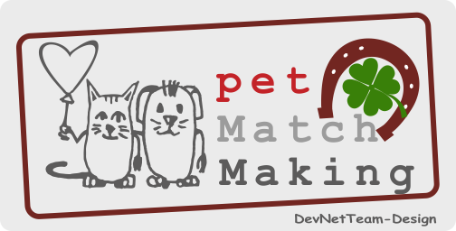

# PetMatchMaking

**PetMatchMaking**: To make Pet parenting an easier, happier & memorable journey we have come up with *A platform* designed for and dedicated to Pet parents / Owners.

## Social Overview
**PetMatchMaking** Owners can create your pet's and their own profile. 
* *Help Request Service*: Get immediate help like lost and found pet, emergency help for abandoned pets or stray animals etc. and more, and more...
* *Meet Request Service*: Explore and find nearby pet owners. Meet with them.
* *Match Request Service*:  Join pet events and participate in exciting pet competitions. Find a perfect match for your pet.

## Social Details
Here are some of the standard features that are included in the project:
**Pet Owners can Find & Connect with**:
* *Dog walkers*.
* *Pets* & other *Pet Owners* in your neighborhood or our city.
* *Pet events*, *parties*, outings & dog shows.
* *Adoption* & *buying pets*: Get notified about all pets available for adoption in your area or city. Connect with reputed breeders in case you prefer buying any specific breed which is not available for adoption.
* *Go to dating*, *Pet Marriage*

## Pet Match Making a community *dedicated to Pets* and make pet parenting an easier, happier & memorable journey with your pets.

# SRS
Read our **[SRS](/SRS_DevNetTeam_Draft.pdf)** for more information.

## How to Use
Read our *[Manual](/UserManual_02.pdf)*

## Web site test
Visit our web site *[Web](https://buda.ninja)*

# Feaures

## All Features
Here are some of the standard features that are included in the project:

* *Profile* Create Owner profile, view, edit
* *Pet* Create profile pet, view, edit, delete, 
* *Request* Create, view, edit delete request
* *Category request* Help, Meet, Match, view all
* *Filter request* Sort all request
* *Map* View on Google Map for profile address, request
* *Filter request* Sort all request, show all
* *Like system* Liking request, mark as done or unliked
* *Rating owner* Rating pet owner for the request
* *Cotact us* Simply email us
* *Info* Contain Policy, Terms, Help, About us, Team
* *Stories* Natural stories about pet.

## Next Features

* *Admin* Easily manage posts, users, and permissions
* *User* Easily create and manage messages

* *Notice* and *messages* between pet owners
* *Pets Search* for *Match Making*
* *More type* and info like *temper* of the pets etc.

* *Blog stories* and *news*

* More [Features](/features.md)

# Maintenance and Evolution
Read our **[Evolution](/Maintenance and Evolution Draft.pdf)** for more information.