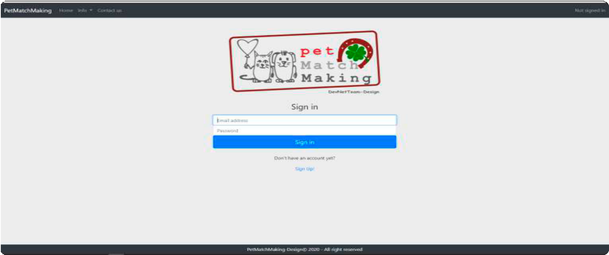
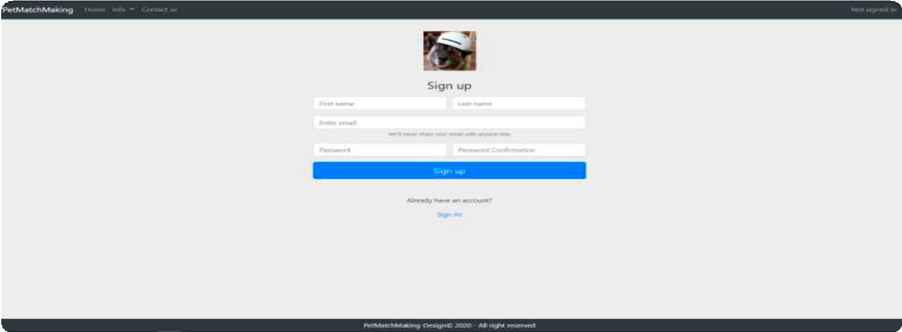
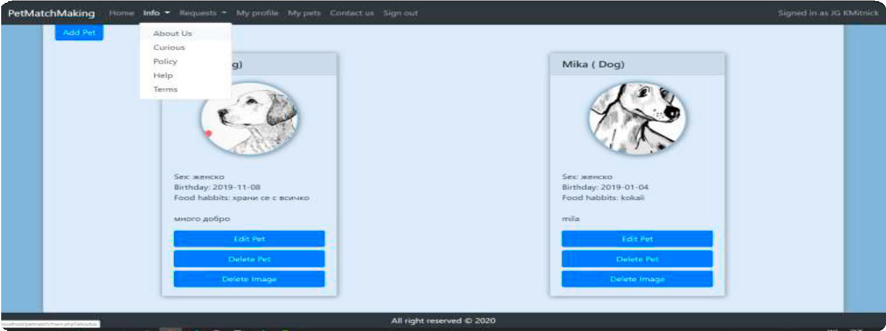
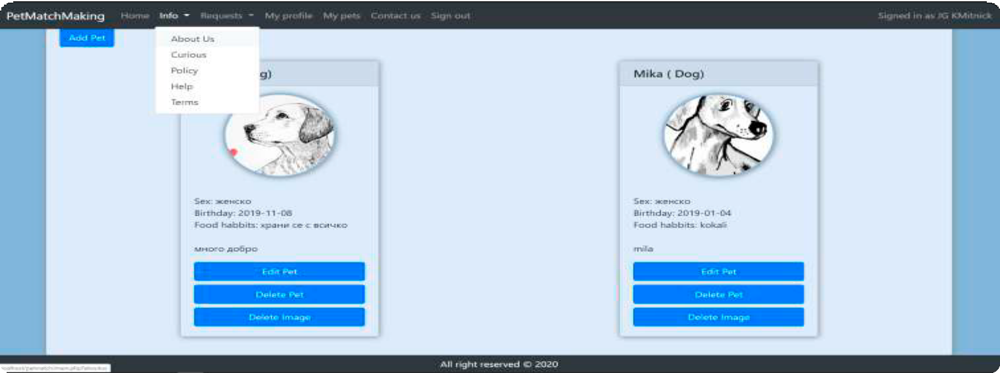
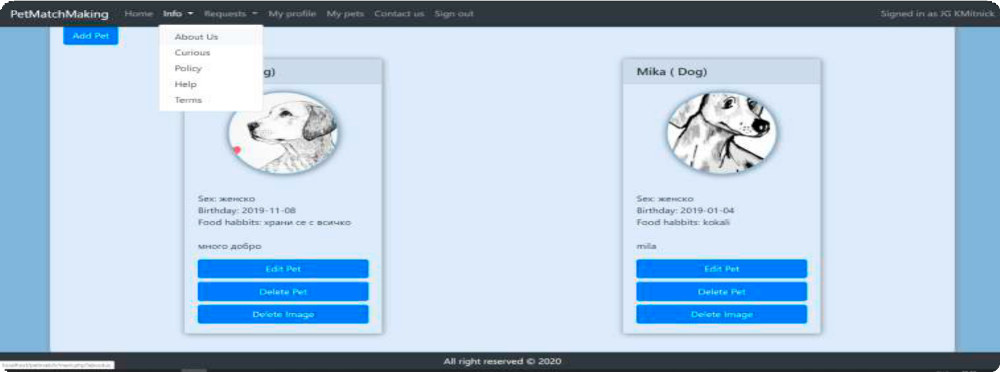
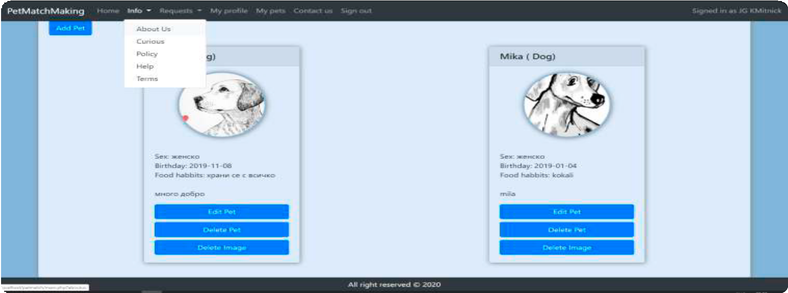
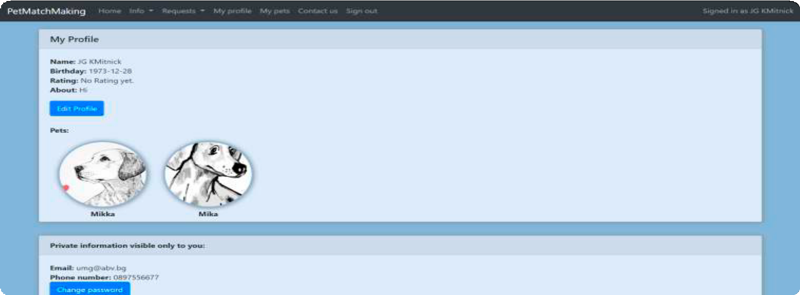
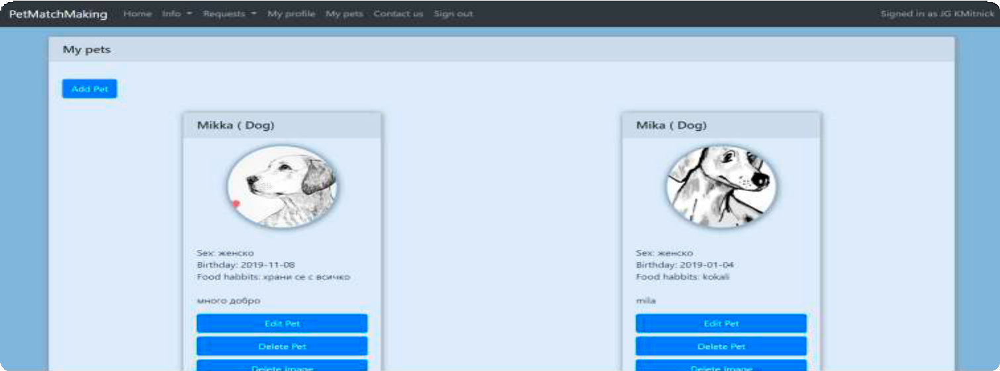
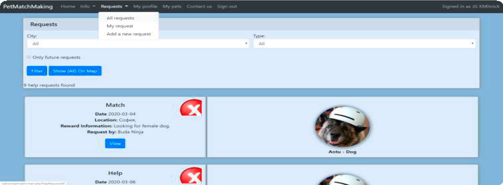
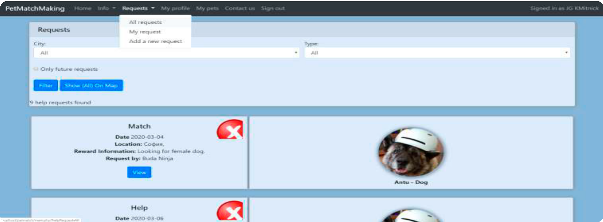

>   *User Manual*

>   *PetMatchMaking.eu*

>   DevNetTeam

>   Sofia 2020

>   **CONTENT**

Sign in/ 3
==========

>   Sign up / Creating a new account 4

>   Info / About us 5

>   Info/ Curious 6

>   Info/ Policy 7

>   Info/ Help 8

>   Info/ Terms 9

>   My profile / Edit profile / Change password 10

>   My Pets / Edit Pet/ Delete Pet/ Delete Image 11

>   Request/ All request/ Only future request/ Filter/ Show (All) On Map 12

>   Request/ My request/ Add request 13

>   Request / Add a new request 14

>   Invites the visitor to sign in to use all the features of the application.

>   Sign Up - prompts the visitor to create a new account. 3

>   Creating a new account.

>   Enter the required account creation information. **4**

>   Information about us.

>   What are we doing. 5

>   Curious.

>   Curious 6

>   Policy declarion.

>   Policy declarion 7

>   Help.

>   Help

>   **Filter** Anything.

>   Search

>   Type something in the input field to search for a specific text inside the
>   div element with id="myDIV":

>   Displays user input.

>   **Edit Profile** - you can change the information.

>   **Change password** - you can change the password. **10**

>   Shows posted ads by the user and allows them to be edited.

>   **Edit Pet** - **Delete Pet** - **Delete Image** -

>   Sshows all requests from registered users of the application.

>   **All request:**

>   Only future request - only shows requests that have not expired.

>   Filter - shows requests from a specific city and type.

>   Show (All) On Map - shows on the map where the applicants are.

>   Sshows all requests from registered users of the application.

>   **My request**

>   Shows only all your queries and allows you to view delete and edit them. Add
>   request.

>   Sshows all requests from registered users of the application.

>   **Add a new request Publish new request**
